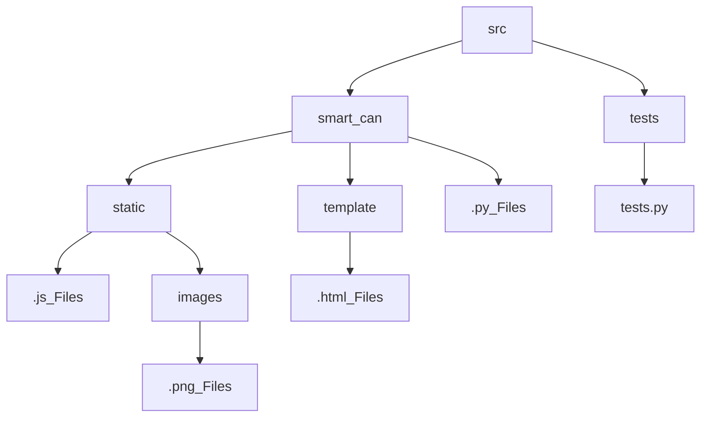

# Smart-Trash
Educational project in the Internet of Things.

# Stack:
Database: 

Framework: 

Regressions:   

# Navigation:

## src - main folder with project

### smart_can - production version
-- __init__.py - initialize abstract class Unit and class of geo
-- __main__.py - start our Flask-project and logger + get blueprint
-- logger.py - connection to database
-- ManageUnits.py - initialize 2 classes: sensors and MainControlUnit
-- route.py - our blueprints for render html code

### tests
-- tests.py - testing enviroment

